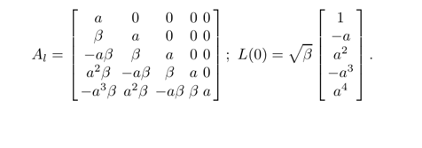
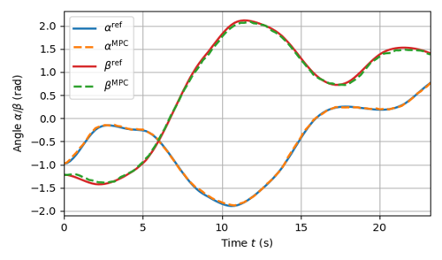
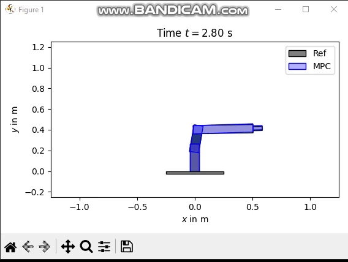
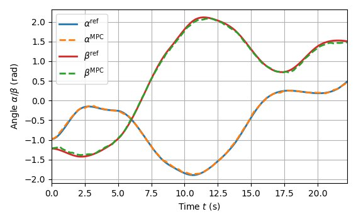
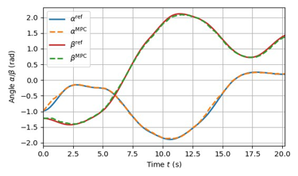
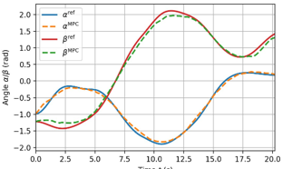
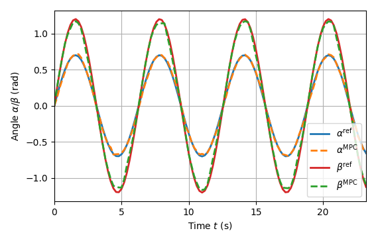

# PINN-Based Model Predictive Control with Laguerre Functions

This project presents an advanced approach to **Nonlinear Model Predictive Control (NMPC)** for multi-link manipulators by integrating **Physics-Informed Neural Networks (PINNs)** with **Laguerre functions**. Our method aims to improve computational efficiency and control performance in trajectory tracking tasks.

## Overview

Building upon the foundational work detailed in [this repository](https://github.com/Jonas-Nicodemus/PINNs-based-MPC), which introduces PINNs into NMPC for multi-body dynamics, our project introduces several key enhancements:

- **Laguerre Function Integration:**  
  We employ **Laguerre functions** to parameterize control inputs, reducing the dimensionality of the control problem and enhancing computational efficiency.

- **Control and Prediction Horizons:**  
  By adjusting the **control horizon (Nu)** and **prediction horizon (Np)**, we achieve a balance between performance and computational load, tailoring the controller's responsiveness to specific application needs.

- **State Constraints:**  
  Incorporation of **explicit state constraints** ensures the system operates within safe and feasible boundaries, enhancing the reliability of the control strategy.

- **Realistic Disturbance Implementation:**  
  To improve realism, we introduce **a disturbance to the states received from the plant**. This simulates real-world uncertainties, allowing the controller to adapt to variations in system dynamics.

---

## 🔍 Key Differences from the Referenced Project

While the referenced project lays the groundwork for using PINNs in NMPC, our approach distinguishes itself through:

1. **Laguerre Function Application:**  
   The original project does **not** utilize Laguerre functions; our integration of these functions streamlines the control input parameterization, leading to improved computational performance.

2. **Dynamic Adjustment of Horizons:**  
   We explore various configurations of **prediction (Np) and control (Nu) horizons**, analyzing their impact on system performance and computational demands, whereas the original project maintains fixed horizons.

3. **Enhanced Constraint Handling:**  
   Our controller explicitly incorporates **state constraints**, ensuring adherence to safety and operational limits, a feature not emphasized in the original implementation.

4. **Disturbance Modeling in Simulation:**  
   Unlike the referenced work, we introduce **stochastic noise (disturbance) in the plant model** to simulate real-world uncertainties. This is implemented by adding Gaussian noise to the plant state outputs.

---


## 📖 Laguerre Functions in Model Predictive Control

To **reduce computational complexity** and **improve real-time performance**, we incorporate **Laguerre functions** in our Model Predictive Control (MPC) framework. This method allows us to approximate the control input, thereby **reducing the optimization problem's dimensionality** and enabling **faster execution**.

Instead of optimizing the control input **directly**, we perform optimization on an intermediate variable **η**, and then reconstruct the control input using:

\[
\mathbf{u} = L^T \mathbf{\eta}
\]

where **L** represents the Laguerre basis functions. The structure of the **Laguerre matrix** and the basis function initialization can be seen below:

🔹 **Laguerre Basis Function Representation**
The following image shows the **Laguerre matrix structure** and the initialization of the **basis function**.



This transformation **reduces the number of optimization variables**, making computations significantly more efficient. However, since we **approximate** the control inputs rather than optimizing them explicitly at each step, we expect some degradation in performance.

---


## 📊 Results

This section presents the **performance of our PINN-based MPC framework** under various conditions. We analyze different **Np and Nu configurations**, explore the impact of **Laguerre functions**, and evaluate the controller's ability to handle disturbances.

### 1️⃣ Performance with Disturbance (Baseline)
We first introduce a **disturbance to the states received from the plant** to create a more realistic simulation. The following results demonstrate the trajectory tracking performance under this disturbance.



#### 🔹 **Simulation GIF**
The following animation visualizes the manipulator's behavior under the influence of the disturbance.



---

### 2️⃣ Effect of Control and Prediction Horizons
The performance of the MPC is affected by the choice of **control horizon (Nu) and prediction horizon (Np)**. Below are results for different settings:

#### 🔹 **Np = 10, Nu = 3**


#### 🔹 **Np = 10, Nu = 7**


#### 🔹 **Np = 20, Nu = 5**


---

### 3️⃣ Incorporating Laguerre Functions
The **Laguerre functions** help **reduce the dimensionality** of the control input parameterization by estimating it instead of computing it directly. Since this approach inherently involves approximation, we expect slightly worse results. However, as seen in the following figure, the performance remains **highly satisfactory**.

#### 🔹 **Np = 20, Nu = 10, N_lag = 3 (Laguerre Pole = 0.9)**


Despite the expected degradation, the controller **still achieves excellent trajectory tracking**.

---

### 4️⃣ Alternative Reference Trajectories
We also tested the controller with a different reference trajectory to assess its generalization capability.

#### 🔹 **Results for Alternative Reference Trajectory**
_This simulation was run with Np = 7, Nu = 5, and N_lag = 3._



#### 🔹 **Simulation GIF**
The following animation showcases the manipulator tracking this alternative reference trajectory.


---

## 📚 References

1. **Physics-Informed Neural Nets for Control of Dynamical Systems**  
   _Eric Aislan Antonelo, Eduardo Camponogara_
2. **Physics-informed Neural Networks-based Model Predictive Control for Multi-link Manipulators**  
   _Jonas Nicodemus, Jonas Kneifl, Jörg Fehr, Benjamin Unger_
3. **Physics-informed Machine Learning**  
   _Karniadakis, G.E., Kevrekidis_ (Nature Reviews Physics)
4. **Modeling, Simulation, and Vision-/MPC-Based Control of a PowerCube Serial Robot**  
   _Fehr, J., Schmid, P., Schneider, G., and Eberhard_
5. **Automatic Differentiation in Machine Learning: A Survey**  
   _Baydin, A.G., Pearlmutter, B.A., Radul, A.A., and Siskind_
6. **State-Space Modeling for Control Based on Physics-Informed Neural Networks**  
   _Arnold, F. and King, R._
7. **Physics-Informed Neural Nets-Based Control**  
   _Antonelo, E.A., Camponogara, E., Seman, L.O., de Souza, E.R., Jordanou, J.P., and Hubner_

---

## 🛠️ How to Run the Code

1. **Clone the repository:**
   ```bash
   git clone https://github.com/your-username/your-repository.git
   cd your-repository


2. **Install dependencies:**
   ```bash
   pip install -r requirements.txt


3. **Run the main script:**
   ```bash
   python main.py
